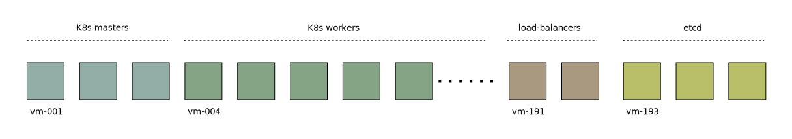

# Xcluster/ovl - k8s-ha

Setup Kubernetes for High Availability (HA). This basically means to
have a redundant control plane nodes behind a load balancer

Keywords: vm-reset,keepalived,haproxy,taint master-nodes

The [K8s HA documentation](
https://kubernetes.io/docs/setup/production-environment/tools/kubeadm/ha-topology/)
describes two options for configuring the topology:

* With stacked control plane nodes, where etcd nodes are colocated with control plane nodes
* With external etcd nodes, where etcd runs on separate nodes from the control plane

This ovl focus on external etcd nodes. To create etcd VMs we can stop
`kubelet` to start on some VMs in the 001-200 range. We also need some
free VMs for the load-balancer(s).



There are many blog posts that describe how to setup K8s-HA. They are
almosts always repeating what's already described in K8s
documentation. The [kubadam High Availability Considerations](
https://github.com/kubernetes/kubeadm/blob/main/docs/ha-considerations.md)
seems to be a good place to start.

As usual, check the ovl script help printout for functions, tests and
start options:

```
./k8s-ha.sh env
./k8s-ha.sh
```


## Cluster start

This is tricky because it differs a lot from the normal K8s start in
`xcluster`. In short, it goes like this:

  1. A init script `120k8s-ha.rc` is executed before K8s setup
  2. It moves all original K8s init scripts to `/etc/rcS.d/`
  3. The moved scripts are replaced with dummy scripts
  4. Relevant K8s init scripts are replaced with ha-adapted ones

The reason for keeping the original K8s init scripts, and not simply
over-write them, is that I hope to modify the originals rather than
maintain a totally separate K8s startup.

K8s is prevented from starting on VMs using the variable `LAST_NODE`, by
default set to 190. The K8s init scripts are modified:
```
test $i -le 200 || exit 0
# To:
test $i -le $LAST_NODE || exit 0
```
This can be added to the `xcluster` repo in the future.


The K8s start can be disabled by setting `K8S_DISABLE=yes`:
```
xcluster_K8S_DISABLE=yes ./k8s-ha.sh test start > $log
```
Etcd is still started.


## Tests

Prerequisite: the `keepalived` program must be downloaded and built:
```
./k8s-ha.sh keepalived --build
```

Since we want to test HA, many tests reboot a VM and checks that
everything works while the VM is away. We can't use `xc scalein` since
it will lose the disk (that is equivalent with replacing HW).
Xcluster VMs reboot in about 1s which usually is too fast for
testing. We want to do things, like a K8s reconfiguration, while a VM
is down. So stop qemu emulation for some time:

```
./k8s-ha.sh stop_vm 193
# Do some updates (optional), and check operation
./k8s-ha.sh reset_vm 193
# Check operation again
# Attach to the VM console if you want to see the reboot
screen -ls
screen -r 175604.xcluster-CP6m -p vm-193
```

The K8s workers are the applications responsibility, but in a K8s HA
setup, operation should work when a load-balancer, one (or many) etcd
nodes or a K8s master are lost. Since we are using external etcd nodes
and also load-balancers out-of-cluster, we can test these situations
separately.

The current tests are rather simple, just verify that the K8s API
server can be reached using `kubectl`. The basic check is that
`kubectl get nodes` should work 10 times in a row. The default test
run a suite. It should be executed for both IPv4 and IPv6:

```
./k8s-ha.sh test > $log
xcluster_BASE_FAMILY=IPv6 ./k8s-ha.sh test > $log
# Takes around 160s for each suite
```

In the future the test should be extended with K8s re-configurations
when some VMs are away. Interresting is for instance that components
like `kube-proxy` reacts when a K8s master is lost.


## Test ETCD stand alone

Etcd is the most complex and most crucial component so it can be
useful to test it without K8s. 

```
#export xcluster_ETCD_FAMILY=IPv6
xcluster_K8S_DISABLE=yes ./k8s-ha.sh test --nvm=0 start_empty > $log
# On a VM
cat /etc/etcd-generated.conf.yaml
# Etcd is configured to listen to [::]:2379, so IPv4 endpoints works always
export ETCDCTL_ENDPOINTS=192.168.1.193:2379,192.168.1.194:2379,192.168.1.195:2379
etcdctl member list -w table
etcdctl endpoint status -w table
etcdctl endpoint health -w table
```

