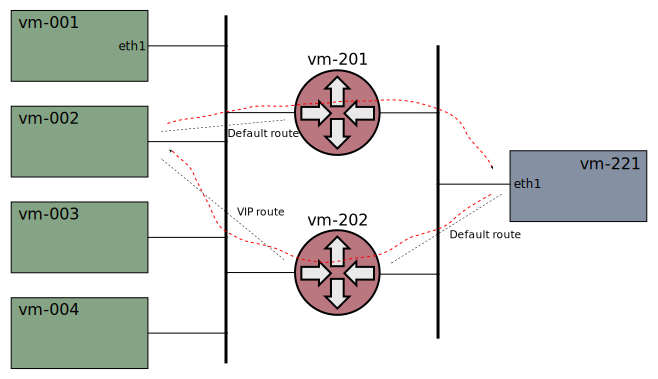

# Xcluster/ovl - k8s-ipvs-local-route

Asymmetric routing, and attempt to set a local route for
ClusterIP-CIDR instead of assigning addresses to `kube-ipvs0`

The usual way to get traffic to ipvs is to have the load-balancer
address (VIP) assigned to a local interface. This causes a great deal
of pain, and what you would *really* wish for is a iptables/nftables
target, like `-j IPVS`.

In K8s all ClusterIPs and loadBalancerIPs are assigned to `kube-ipvs0`
which is a Linux "dummy interface", and is always DOWN. Now, it turns
out that addresses doesn't reall have to be assigned, but it's
sufficient with a local route in the `local` routing table.

The aim is to replace all assigned ClusterIPs with a single rule like:

```
ip route add local <ClusterIP-CIDR> dev kube-ipvs0 scope host src <node-ip>
```

Keywords: source-based route, asymmetric routing


## Asymmetric Routing

Outgoing packets are (usually) sent via the "default route". But when
incoming packets can arrive via different routers, or different
networks, we get asymmetric routing:



This is a test setup. A real-life use-case is for instance if the K8s
nodes are connected to two networks:

* A traffic network serving normal user-requests. The default route is
  set to a GW on this network
* An OaM network

The OaM network should be protected from attacks via the traffic
network. Return traffic for requests coming from the OaM network
**must** be routed to a GW on the OaM network.

Manual test of asymmetric routing:
```
./k8s-ipvs-local-route.sh test start_policyroute > $log
# OR:
xcadmin k8s_test --cni=calico k8s-ipvs-local-route start_policyroute > $log
# (or another CNI-plugin: cilium, flannel, antrea)
# On vm-201 and vm-202
tcpdump -ni eth1 port 5001
# On vm-221
mconnect -address 10.0.0.0:5001 -nconn 4
```

To avoid this problem you can use the [Cilium](https://cilium.io/)
CNI-plugin with `kube-proxy` replacement. It sends return packets beck
to the GW it came from, regardless of the default route.

A fix for the problem can also be found in [metallb-node-route-agent](
https://github.com/travisghansen/metallb-node-route-agent).


### Avoid asymmetric routing with route configuration

The problem *can* be solved with a direct route:

```
# On vm-002
ip route add 192.168.2.221/32 via 192.168.1.202
# On vm-221
mconnect -address 10.0.0.0:5001 -nconn 4
```

However, the OaM network is likely quite complex, so static routes are
not feasible. A routing protocol, like BGP, must probably be
used. This includes routing daemons on the K8s nodes and configuration
of GWs which is hard to maintain.

Instead, a source-based policy route may be used. This means that
packets *from* the loadBalancerIP's of the OaM services on the cluster
are routed to the GW on the OaM network.

```
ip route del 192.168.2.221/32  # (if necessary)
ip rule add from 10.0.0.0/32 table 44
ip route add default via 192.168.1.202 table 44
# On vm-221
mconnect -address 10.0.0.0:5001 -nconn 4
```

This is exactly what we want, a simple local configuration. It even
adds some extra security since requests to OaM services via the
traffic networks (attacks) will have the responses routed to the OaM
GW and be dropped.

Unfortunately this comes with some drawbacks like:

* Source-based policy routes only work with proxy-mode=ipvs
* Requests to the OaM loadBalancerIP's does not work from the main
  netns on K8s nodes
* Connect to loadBalancerIP's from within PODs fails

The problem with proxy-mode=iptables is that the rule is checked
*before* the (reversed) DNAT POD-IP -> loadBalancerIP, so the rule is
never hit.

The problem in main netns is that the requests are routed to the
`kube-ipvs0` device and gets the loadBalancerIP as source. This hit
the rule, and the requests are sent to the OaM GW (with a POD-IP as
dest). This problem can be fixed by setting a local route with the
node IP as source:

```
# On vm-002
mconnect -address 10.0.0.0:5001 -nconn 4  # FAILS!
ip route replace local 10.0.0.0 dev kube-ipvs0 scope host src 192.168.1.2
mconnect -address 10.0.0.0:5001 -nconn 4  # Works
# On vm-221
mconnect -address 10.0.0.0:5001 -nconn 4  # Still works
```

This "fix" can't be applied by the node owner, but requires a change
of the `kube-proxy` in K8s, like the one local rule described earlier.

